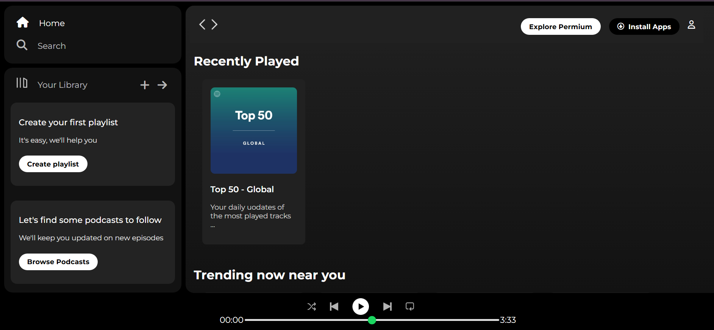

# 🎵 Spotify Clone - Web Player

A clean and responsive **Spotify Web Player UI Clone** built using **HTML, CSS**, and **Font Awesome**. This project replicates the layout and functionality of the official Spotify Web App interface (without actual music streaming functionality).



## Features

- Responsive layout inspired by Spotify's web player
- Sidebar with navigation (Home, Search, Library)
- Sticky navigation bar for premium promotion and install options
- Cards for recently played, trending, and featured content
- Music player UI with playback controls
- Styled range slider for playback timeline
- Font Awesome icons integration
- Fully mobile-responsive with media queries


## Tech Stack

- HTML5
- CSS3
- Font Awesome (via CDN)
- Google Fonts (`Montserrat`)

## Responsive Design

The UI adapts smoothly to screen sizes using `@media` queries. Some elements (like buttons and icons) are conditionally hidden on smaller screens for a cleaner user experience.

## Live Preview

You can view a live preview by opening `index.html` in your browser or deploying it via GitHub Pages, Netlify, or Vercel.

## How to Use

1. Clone the repository:
   ```bash
   git clone https://github.com/deep-maji/Spotify-Clone.git
   cd spotify-clone

# Known Limitations
    No real audio playback functionality

    No backend or dynamic data (static UI only)

    Not connected to Spotify APIs

# Author: Deep Maji

GitHub: [deep-maji](https://github.com/deep-maji)

LinkedIn: [Deep Maji](https://www.linkedin.com/in/deep-maji-bb299a30a/)